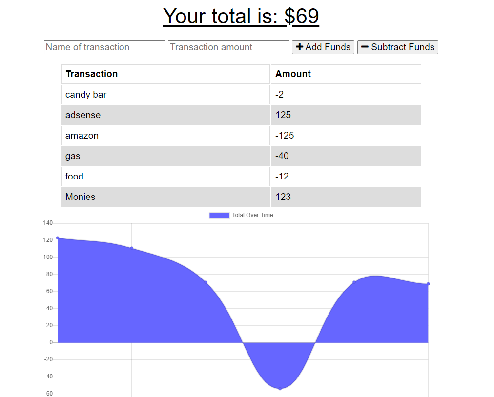

    

# Budget Tracker with Offline capabilities

***
## Table of Contents
 * [Description](#Description)
 * [Usage](#Usage)
 * [Installation](#Installation)
 * [Application](#Application)
 * [Contribution](#Contribution)

##Description
This budget tracker allows you to keep track of your in, and outgoing expenses on a full, throttled, or offline(after initial visit) connection to the internet.

## Usage
Head over to the [deployed application](https://obscure-plains-51896.herokuapp.com/)(or clone this repo to your machine)If you are interested in testing this please head over to the [deployed application](https://obscure-plains-51896.herokuapp.com/), open up the inspector, navigate to the network tab to modify the throttling.

## Installation
To install go ahead and clone this repo and open a command prompt in that directory. Make sure that you have MongoDB running and then run the commands "npm i" and "npm start" After this navigate to localhost:3001 and have at it!

## Application
[Here is a link to the deployed application](https://obscure-plains-51896.herokuapp.com/) or click the Website badge at the top.

## Contribution
* Jason Offenbaker 
* UofA 
